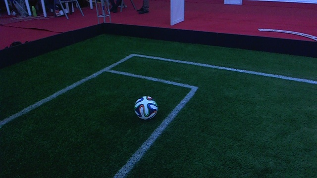
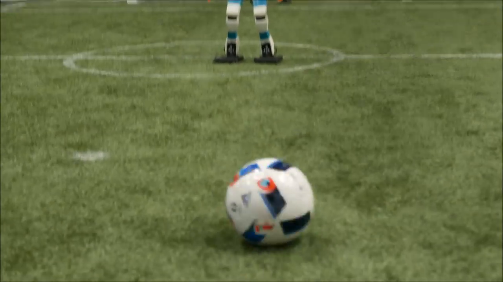
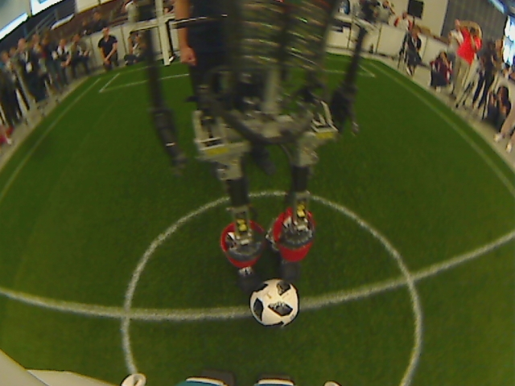
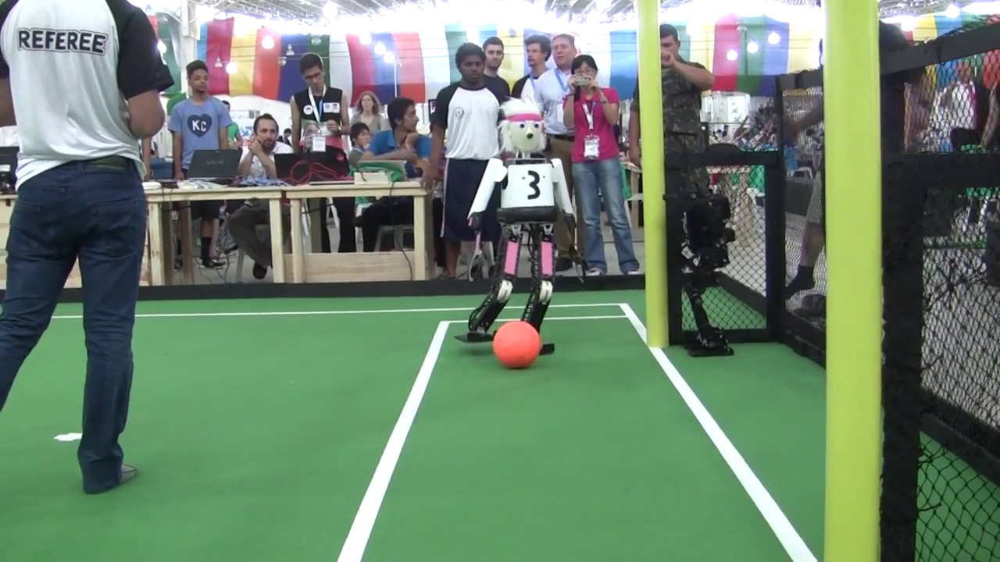
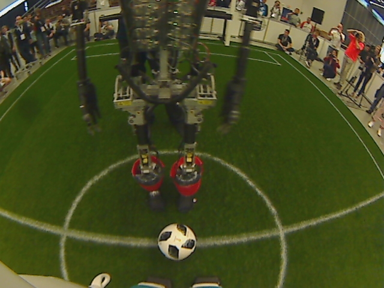

# Mini-semantic-segmentation-network-pytorch
This repository contains an implementation of a miniature version of the UNet architecture which is used for semantic semantic.
The architecture and training methodology is based on this paper https://arxiv.org/pdf/1810.08395.pdf.

## Highlights of the architecture
* It is a fully convolutional neural network, with the encoder-decoder architecture used in SegNet [1].
* It has lateral skip connections as introduced in UNet [2].
* The main difference between UNet and this architecture is that the decoder is made smaller and hence the segmented output of the network is only one-fourth of the input.
* This significantly reduces the number of parameters of the network and allows for resource efficient inference, for instance in robots used in Robocup soccer.

## Network Training
* A copy of the trainset is created which consists of low resolution images (half the resolution of the original image).
* The encoder part of the network consists of a pre-trained ResNet18.
* For the first 30 epochs, the network is trained on low-resolution images with frozen encoder weights, thereby only optimizing the decoder weights.
* For the next 15 epochs, the network is trained on low-resolution images with the weights of the encoder unfrozen.
* Then the entire network is trained on full resolution images until 80 epochs.
* The appropriate learning rate is chosen based on cyclical learning rates [3].

## Examples of segmented images

The network is trained on a dataset of Robocup soccer images to segment the field, field lines and the ball.

  
  
  
  
  
  

[Figure: The image on the left in each pair
of images is the ground truth label and the right image is the network’s
prediction]

## References
1. V. Badrinarayanan, A. Kendall, and R. Cipolla, “Segnet: A deep convolutional
encoder-decoder architecture for image segmentation,” IEEE transactions on pat-
tern analysis and machine intelligence, vol. 39, no. 12, pp. 2481–2495, 2017.

2. O. Ronneberger, P. Fischer, and T. Brox, “U-net: Convolutional networks for
biomedical image segmentation,” in International Conference on Medical image com-
puting and computer-assisted intervention, pp. 234–241, Springer, 2015.

3. L. N. Smith, “Cyclical learning rates for training neural networks,” in Applications of
Computer Vision (WACV), 2017 IEEE Winter Conference on, pp. 464–472, IEEE,
2017.

